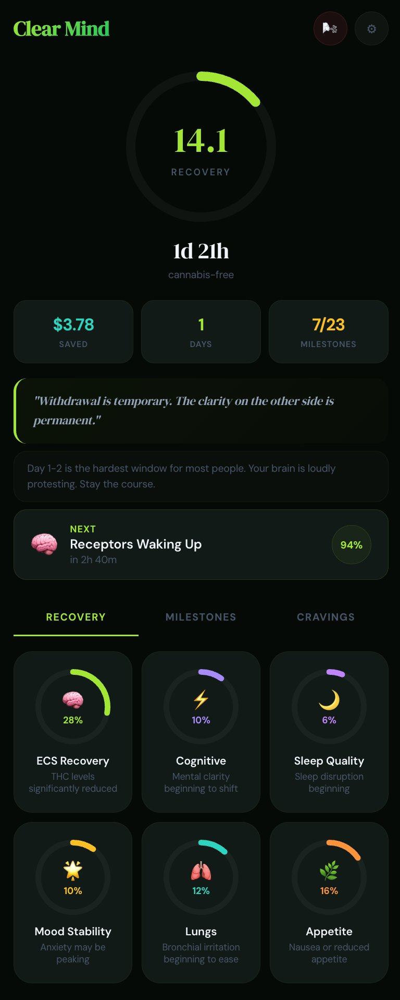
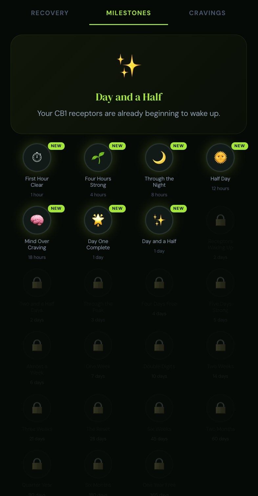
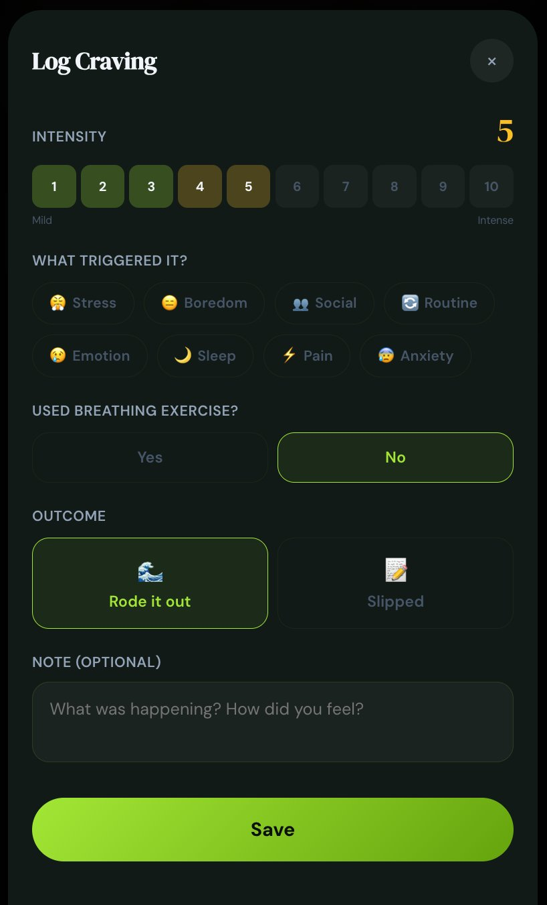

# Quit Tracker PWAs

Two progressive web apps for tracking recovery from substance use, built with React (Babel standalone), designed for mobile-first offline use.

## Screenshots

<p align="center">
  
  
  
</p>

## Apps

### Clear Mind (Cannabis)
**Live:** [clearmind.mikegrowsgreens.com](https://clearmind.mikegrowsgreens.com)

Track your brain's recovery from cannabis with clinically sourced milestones and weighted scoring.

Health categories: ECS Recovery, Cognitive, Sleep Quality, Mood Stability, Lungs, Appetite.

### Clear Air (Nicotine/Vaping)
**Live:** [clearair.mikegrowsgreens.com](https://clearair.mikegrowsgreens.com)

Track cardiovascular and respiratory recovery from vaping with evidence-based milestones.

Health categories: Cardiovascular, Respiratory, Senses, Blood Oxygen, Nicotine Clearance, Immune System.

## Features

- Weighted recovery scoring with phase-based calculations
- 23 achievement milestones (20 minutes to 1 year)
- 4-4-6 breathing exercise for acute cravings
- Cravings log with intensity tracking, trigger identification, and outcome logging
- Craving insights: success rate, top triggers, weekly stats
- 3-screen onboarding flow
- Full PWA: installable, offline-capable
- All data stored locally in localStorage. No server, no tracking, fully private.

## Tech Stack

- React 18 via Babel standalone (single-file architecture)
- CSS custom properties for theming
- DM Sans + DM Serif Display typography
- Service worker for offline caching
- No build step required

## Clinical Sources

Cannabis recovery: Hirvonen 2012, D'Souza 2016, Schuster 2018, Hanson 2010, PMC, Sleep Foundation, Recovery Research Institute.

Nicotine recovery: AHA, ALA, WHO, NIDA, Cleveland Clinic, Johns Hopkins.

## Deployment

Each app is a single HTML file + manifest + service worker. Deploy to any static host:

```bash
scp clearmind/* root@yourserver.com:/var/www/clearmind/
scp clearair/* root@yourserver.com:/var/www/clearair/
```

Currently served via Caddy reverse proxy on DigitalOcean.

## Version History

- **v3.1** - Cravings log with trigger tracking, breathing integration, insights dashboard
- **v3.0** - Full rebuild: Babel standalone, weighted scoring, achievements, breathing exercise, onboarding
- **v2.0** - Initial PWA with basic timer and milestones

## License

MIT
